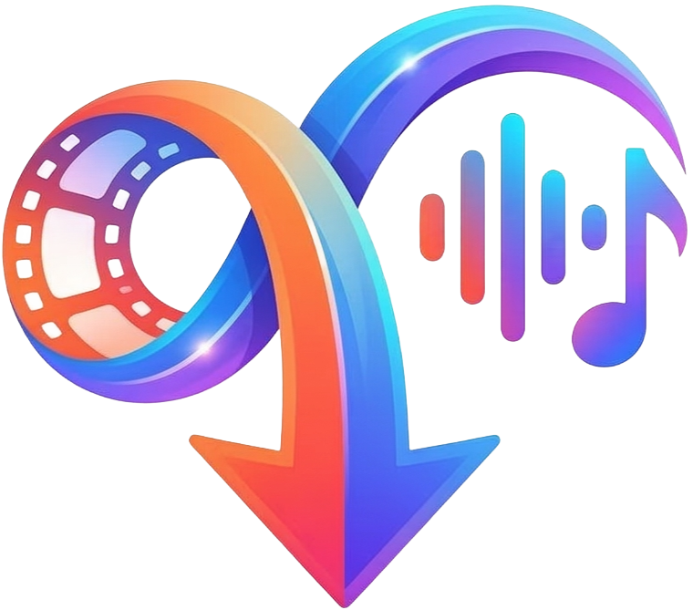

# 🎬 ViDrop Downloader

<div align="center">
  

  **Multi-Platform Video & Audio Downloader**

  *A powerful, cross-platform mobile application for downloading videos and audio from popular social media platforms*

  [](https://flutter.dev)
  [](https://dart.dev)
  [](https://developer.android.com)
  [](https://developer.apple.com/ios/)

  [](https://github.com/yasinagahan16/vidropdownloader-app/releases)
  [](LICENSE)

  <br/>

  [📥 Download APK](https://github.com/yasinagahan16/vidropdownloader-app/releases) • [🐛 Report Bug](https://github.com/yasinagahan16/vidropdownloader-app/issues) • [💡 Request Feature](https://github.com/yasinagahan16/vidropdownloader-app/issues)

</div>

---

## ✨ Features

| Feature | Description |
|---------|-------------|
| 🎥 **Video Download** | Download videos in the highest available quality |
| 🎵 **Audio Extraction** | Extract high-quality audio (M4A) from videos |
| 🌐 **Multi-Platform** | Support for YouTube, Twitter/X, Instagram, TikTok |
| 🌍 **Multi-Language** | Turkish and English interface |
| 🌓 **Dark/Light Theme** | Eye-friendly theme options |
| 📋 **Auto-Detection** | Automatically detects platform from URL |
| 📂 **Gallery Integration** | Downloaded files appear directly in gallery |
| 🔒 **Privacy Focused** | No data collection, downloads happen on-device |
| ⚡ **Serverless** | Direct download without intermediary servers |

---

## 🌐 Supported Platforms

<div align="center">

| Platform | Video | Audio | Quality |
|:--------:|:-----:|:-----:|:-------:|
|  | ✅ | ✅ | Up to 4K |
|  | ✅ | ✅ | Best Available |
|  | ✅ | ✅ | Best Available |
|  | ✅ | ✅ | Best Available |

</div>

---

## 🛠️ Technical Stack

### Mobile Development

<div align="center">

| Technology | Purpose | Expertise Level |
|:----------:|:-------:|:---------------:|
|  | Cross-platform UI Framework | ⭐⭐⭐⭐⭐ |
|  | Primary Language | ⭐⭐⭐⭐⭐ |
|  | Android Native | ⭐⭐⭐⭐ |
|  | iOS Native | ⭐⭐⭐⭐ |

</div>

### Architecture & Patterns

- **Clean Architecture** - Separation of concerns with services, models, and screens
- **State Management** - Efficient state handling with StatefulWidget
- **Async/Await** - Non-blocking I/O operations for smooth UX
- **Error Handling** - Comprehensive try-catch with user-friendly messages
- **Multi-API Fallback** - Redundant API endpoints for reliability

### Key Libraries & Dependencies

```yaml
dependencies:
  # Core
  flutter: SDK
  cupertino_icons: ^1.0.8

  # Networking & API
  http: ^1.2.0                    # REST API communication
  dio: ^5.9.2                     # Advanced HTTP client

  # Media Processing
  youtube_explode_dart: ^3.0.0    # YouTube data extraction
  video_compress: ^3.1.4          # Video compression & processing

  # Platform Integration
  permission_handler: ^12.0.1     # Runtime permissions
  device_info_plus: ^11.3.0       # Device information
  path_provider: ^2.1.5           # File system access
  url_launcher: ^6.2.5            # External URL handling
  open_file: ^3.5.9               # File opening
```

### Backend & API Integration

- **YouTube**: Direct stream extraction using `youtube_explode_dart`
- **Instagram**: Custom API integration with SnapSave decoder
- **Twitter/X**: Multiple fallback APIs (twitsave, twittervideodownloader)
- **TikTok**: TikWM API integration with watermark removal

---

## 🏗️ Architecture Overview

```
┌─────────────────────────────────────────────────────────────┐
│                        UI Layer                              │
│    ┌─────────────────────────────────────────────────────┐  │
│    │              HomeScreen (Flutter)                    │  │
│    │   • URL Input • Platform Detection • Download UI    │  │
│    └─────────────────────────────────────────────────────┘  │
├─────────────────────────────────────────────────────────────┤
│                      Service Layer                           │
│    ┌──────────────┐  ┌──────────────┐  ┌──────────────┐    │
│    │   Download   │  │     API      │  │   Storage    │    │
│    │   Service    │  │   Service    │  │   Service    │    │
│    └──────────────┘  └──────────────┘  └──────────────┘    │
├─────────────────────────────────────────────────────────────┤
│                     Platform Layer                           │
│    ┌────────────┐  ┌────────────┐  ┌────────────────────┐  │
│    │  Android   │  │    iOS     │  │  Media Store API   │  │
│    │  (Kotlin)  │  │  (Swift)   │  │  (Gallery Access)  │  │
│    └────────────┘  └────────────┘  └────────────────────┘  │
└─────────────────────────────────────────────────────────────┘
```

---

## 📥 Installation

### Android

1. Download the latest APK from [Releases](https://github.com/yasinagahan16/vidropdownloader-app/releases)
2. Enable "Install from Unknown Sources" in your device settings
3. Open the APK file and install
4. Grant storage permissions when prompted

### iOS

*iOS version coming soon via TestFlight*

---

## 🔧 System Requirements

| Platform | Minimum | Recommended |
|----------|---------|-------------|
| **Android** | API 21 (5.0 Lollipop) | API 30+ (Android 11+) |
| **iOS** | iOS 12.0 | iOS 15.0+ |
| **Storage** | 100 MB free | 500 MB+ free |
| **RAM** | 2 GB | 4 GB+ |

---

## 🔐 Privacy & Security

- ✅ **No user data collection** - Your privacy is respected
- ✅ **No analytics tracking** - No third-party trackers
- ✅ **On-device processing** - All downloads happen locally
- ✅ **No account required** - Use immediately without registration
- ✅ **Open permissions** - Only requests necessary permissions

---

## 👨‍💻 Developer

<div align="center">

**Yasin Akın**

[](https://github.com/yasinagahan16)

</div>

### Skills Demonstrated in This Project

| Category | Technologies |
|----------|-------------|
| **Mobile Development** | Flutter, Dart, Kotlin, Swift |
| **API Integration** | REST APIs, JSON parsing, HTTP clients |
| **Media Processing** | Video/Audio extraction, Format conversion |
| **UI/UX Design** | Material Design, Responsive layouts, Theme systems |
| **Software Architecture** | Clean Architecture, Service patterns, State management |
| **Problem Solving** | Multi-API fallback systems, Error handling, Edge cases |

---

## ⚠️ Disclaimer

This application is intended for personal use only. Please respect copyright laws and terms of service of the platforms you download from. The developer is not responsible for any misuse of this application.

---

## 📄 License

This project is **proprietary software**. The source code is not available for public distribution, modification, or commercial use.

See [LICENSE](LICENSE) for more information.

---

<div align="center">

  **Made with ❤️ in Turkey**

  ⭐ Star this repo if you find it useful!

</div>
